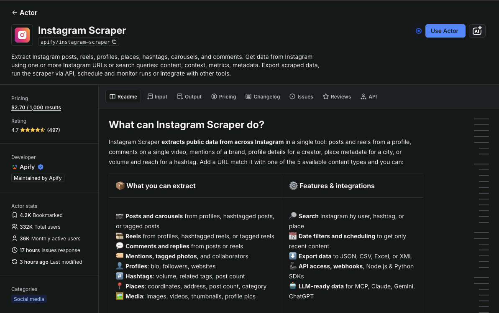
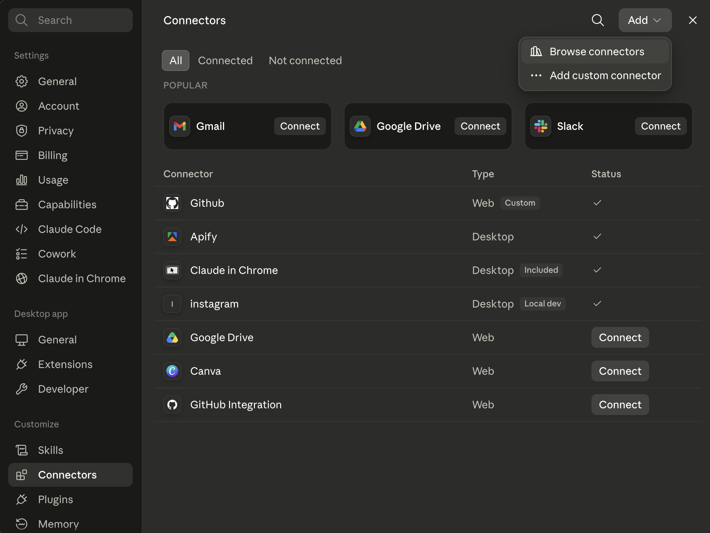
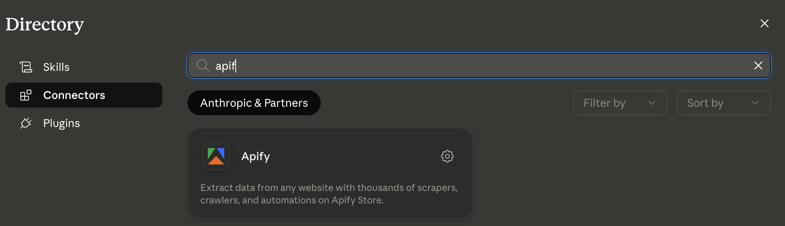
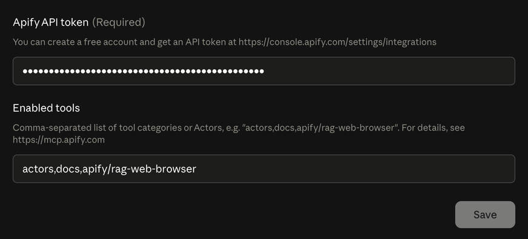
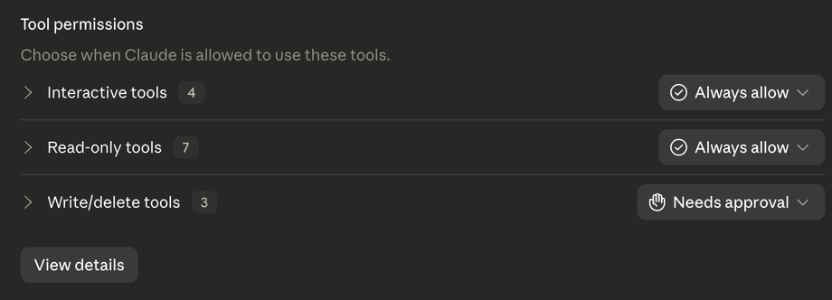
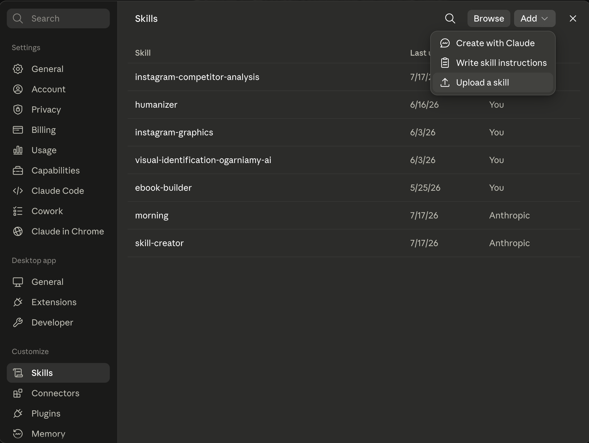
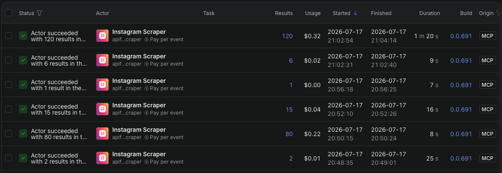

W tym artykule pokażę Ci, jak połączyć Claude z Apify i przeprowadzić analizę konkurencji na Instagramie bez ręcznego przepisywania danych do arkusza. Całość możesz przetestować bezpłatnie, korzystając z darmowych planów obu narzędzi.

## Spis treści

- [Po co analizować konkurencję](#po-co-analizować-konkurencję)
- [Czym jest Apify](#czym-jest-apify)
- [Krok 1: załóż konto w Apify](#krok-1-załóż-konto-w-apify)
- [Krok 2: zainstaluj Claude](#krok-2-zainstaluj-claude)
- [Krok 3: połącz Claude z Apify](#krok-3-połącz-claude-z-apify)
- [Krok 4: ustaw uprawnienia](#krok-4-ustaw-uprawnienia)
- [Krok 5: zainstaluj skill do analizy](#krok-5-zainstaluj-skill-do-analizy)
- [Krok 6: uruchom analizę (prompt)](#krok-6-uruchom-analizę)
- [O czym warto pamiętać](#o-czym-warto-pamiętać)
- [Na koniec](#na-koniec)

## Po co analizować konkurencję

Obserwacja innych kont to jeden z pierwszych kroków przy rozwijaniu firmy albo marki osobistej na Instagramie. Pozwala sprawdzić, jakie tematy i formaty pojawiają się w danej niszy, co przyciąga uwagę oraz gdzie zostaje miejsce na coś, czego inni jeszcze nie robią.

Nie chodzi o kopiowanie. Dobra analiza ma pomóc zrozumieć rynek, znaleźć niewykorzystane obszary i podejmować decyzje na podstawie danych. Ręczne zbieranie materiału z kilku kont jest mozolne i zajmuje wiele godzin. Tutaj tę pracę przejmą Claude i Apify.

## Czym jest Apify

[Apify](https://apify.com) to platforma z gotowymi narzędziami do pobierania publicznych danych z internetu. Takie narzędzia nazywają się tam **Actors**, czyli aktorzy. Każdy jest przygotowany do innego zadania: może zbierać dane z konkretnego serwisu albo automatyzować określony proces. Instagram Scraper jest jednym z nich, ale w Apify Store znajdziesz też wiele innych aktorów, które możesz później podłączyć do Claude i wykorzystać w podobny sposób.

W tym poradniku skorzystam z aktora [Instagram Scraper](https://apify.com/apify/instagram-scraper), którego Claude będzie uruchamiał bezpośrednio z rozmowy przez connector MCP.

Darmowy plan Apify daje obecnie **5 dolarów kredytu miesięcznie**. Sam Instagram Scraper ma osobny cennik i pobiera opłatę za każdy zwrócony wynik. Na planie darmowym kosztuje obecnie **2,70 dolara za 1000 wyników**, dlatego podstawowa analiza kilku kont powinna zmieścić się w darmowej puli. Aktualne warunki sprawdzisz osobno w [cenniku planów Apify](https://apify.com/pricing) oraz w [cenniku Instagram Scrapera](https://console.apify.com/actors/shu8hvrXbJbY3Eb9W/info/pricing?build=latest).



## Krok 1: załóż konto w Apify

Wejdź na [apify.com](https://apify.com) i utwórz darmowe konto. Nie musisz ręcznie konfigurować scrapera. Potrzebujesz jedynie aktywnego konta, z którego connector będzie mógł korzystać.

## Krok 2: zainstaluj Claude

Pobierz aplikację Claude na komputer z oficjalnej strony:

[Pobierz Claude Desktop](https://claude.com/download)

Na moment przygotowywania tego poradnika connector Apify **wymaga aplikacji Claude Desktop**. W przeglądarce Claude wyświetla informację, że trzeba zainstalować wersję na komputer, dlatego nie pomijaj tego kroku. Integracje zmieniają się jednak dość szybko, więc jeśli czytasz ten artykuł później, możesz sprawdzić w **Customize → Connectors**, czy obsługa Apify w przeglądarce nie została już dodana.

Do testu wystarczy darmowe konto Claude. Przy większej analizie polecam plan **Pro**, ponieważ cały proces zużywa sporo limitu i na darmowym planie może zatrzymać się w połowie (wtedy trzeba czekać 5h na reset limitów).

## Krok 3: połącz Claude z Apify

1. Otwórz Claude i przejdź do **Customize → Connectors**.
2. Kliknij **Add → Browse connectors**.

   

3. Wyszukaj **Apify** i otwórz znaleziony connector.

   

4. W polu **Apify API token** wklej token ze swojego konta.

   

5. Pole **Enabled tools** pozostaw bez zmian i kliknij **Save**.

### Gdzie znaleźć API token

W oknie konfiguracji connectora, tuż nad polem **Apify API token**, znajduje się gotowy link prowadzący do właściwej strony w Apify. Kliknij go albo skopiuj do przeglądarki, a następnie skopiuj swój token i wklej go w pole w Claude. Możesz też znaleźć go ręcznie w Apify Console w **Settings → API & Integrations**. Token działa podobnie jak hasło, dlatego nie udostępniaj go ani nie pokazuj na zrzutach ekranu.

## Krok 4: ustaw uprawnienia

W tym samym oknie przejdź do **Tool permissions** i ustaw:

- **Interactive tools** na **Always allow**,
- **Read-only tools** na **Always allow**,
- **Write/delete tools** na **Needs approval**.

Dzięki temu Claude nie będzie pytał o zgodę przy każdym odczycie, ale operacje mogące coś zmienić nadal będą wymagały zatwierdzenia. W nowej rozmowie kliknij jeszcze **+ → Connectors** i sprawdź, czy Apify jest włączone.



## Krok 5: zainstaluj skill do analizy

Do tego procesu sam przygotowałem skill, którego używałem podczas własnych analiz. Jest to instrukcja mówiąca Claude'owi, jak poprowadzić pracę od pierwszych pytań do gotowego raportu. Dzięki temu nie musisz za każdym razem opisywać całego procesu od nowa.

Najpierw pobierz skill:

**Skill do pobrania:** [instagram-competitor-analysis.zip](https://ogarniamy.ai/files/WyUEB4trd3_COp2EuMYhEob0kriCGgix)

Potem wejdź w **Settings → Capabilities** i sprawdź, czy masz włączone **Code execution and file creation**. Bez tej funkcji skille mogą nie pojawić się w ustawieniach.

1. Przejdź do **Customize → Skills**.
2. Kliknij znak **+**, a następnie **Create skill**.
3. Wybierz **Upload a skill**.
4. Wgraj pobrany plik ZIP.
5. Sprawdź, czy nowy skill jest włączony na liście.



Skille działają również na darmowym planie Claude. Możesz później zmodyfikować ten plik i dopasować instrukcję precyzyjniej pod siebie.

## Krok 6: uruchom analizę

Otwórz nową rozmowę i napisz, że chcesz przeprowadzić analizę konkurencji na Instagramie. Możesz podać konkretne profile, wkleić adres własnego konta albo opisać niszę i pozostawić wybór kont Claude'owi.

Przygotowałem też gotowy prompt startowy. Uzupełnij pola dotyczące swojej marki i wklej go do nowej rozmowy:

```
Zrób mi pełną analizę konkurencji na Instagramie.

Moje konto: [np. @twojanazwa]
Nisza / branża: [np. narzędzia AI dla początkujących, dietetyka kliniczna, automatyzacja małych firm, zagraniczne kursy językowe]
Odbiorca, do którego mówię: [np. osoby, które boją się AI i nie wiedzą, od czego zacząć]
Konkurencja, którą znam: [wymień konta, jeśli masz listę, albo napisz "nie mam listy, znajdź kandydatów"]
Konta, które sam obserwuję w tej niszy: [wymień, nawet jeśli nie uważasz ich za konkurencję wprost]
Cel analizy: [np. podniesienie zaangażowania / pomysły na treści / start nowego konta / zrozumienie pozycjonowania rywali]
Format raportu: markdown / PDF
Kolory PDF: [podaj kolor akcentu w formacie #RRGGBB, albo napisz "wybierz sam" / "zapytaj mnie na etapie generowania"]

Chcę też:
- kartę wyników mojego konta na tle konkurencji
- wykresy (zasięg do bazy obserwujących, rozrzut wyników, kto rośnie a kto gaśnie, rolki kontra karuzele)
- gotowe pomysły na posty wyprowadzone z tego, co u nich działa, i z tego, czego w niszy brakuje
- słowniczek pojęć, bo nie znam się na żargonie analityki social media
```

Claude zada kilka pytań doprecyzowujących, a następnie rozpocznie pobieranie i analizę danych. Cały proces może potrwać od kilku do kilkudziesięciu minut. Po zakończeniu możesz dalej zadawać pytania i zlecać kolejne zadania na podstawie informacji zgromadzonych w tej rozmowie.

W Apify Console możesz w każdej chwili sprawdzić historię uruchomień, liczbę wyników i koszt każdej operacji:



## O czym warto pamiętać

Analiza zużywa jednocześnie kredyty Apify oraz limit Claude. **Im więcej kont i publikacji zlecisz do sprawdzenia, tym dłużej potrwa cały proces i tym szybciej wykorzystasz oba limity.** Każdy kolejny post to dodatkowy wynik pobrany przez Apify oraz więcej danych, które Claude musi przeczytać i porównać. Zacznij więc od kilku kont i niewielkiej liczby publikacji, a większe zadanie uruchamiaj najlepiej tuż po odnowieniu limitu Claude.

Wyższy **effort** może poprawić końcowe wnioski, ale szybciej zużywa limit. Do większości procesu wystarczy Sonnet z domyślnym albo wysokim effortem. Najmocniejszy model warto zostawić na przygotowanie końcowego raportu.

Korzystaj wyłącznie z publicznie dostępnych informacji i pamiętaj, że raport jest punktem wyjścia do własnych decyzji, a nie nieomylną instrukcją. Instagram nie pokazuje publicznie wszystkich statystyk, dlatego Claude analizuje tylko tę część obrazu, którą da się zebrać z zewnątrz jako zwykły użytkownik.

## Na koniec

Po jednorazowym skonfigurowaniu Apify, connectora i skilla kolejne analizy sprowadzają się już głównie do opisania celu oraz wskazania kont. Najbardziej mozolną część pracy przejmują narzędzia, a Ty dostajesz uporządkowany materiał, do którego możesz wracać z kolejnymi pytaniami.

Zacznij od małego testu, sprawdź jakość raportu i dopiero później zwiększaj zakres. Nie traktuj wniosków Claude'a jak gotowej recepty na rozwój profilu, ale jak punkt wyjścia do podejmowania lepszych decyzji i planowania własnych eksperymentów. Największą przewagę daje nie samo posiadanie danych, lecz umiejętność zauważenia w nich miejsca, którego inni jeszcze nie zagospodarowali.
