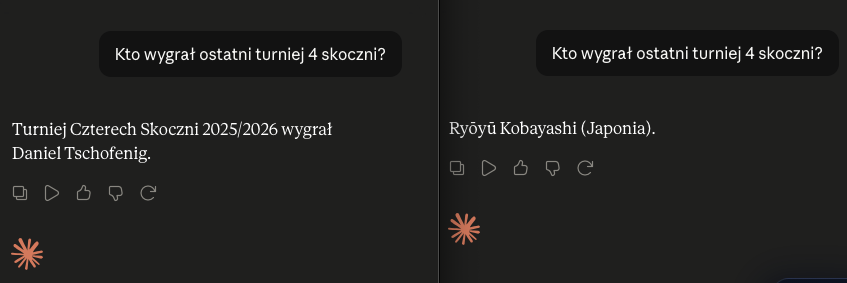
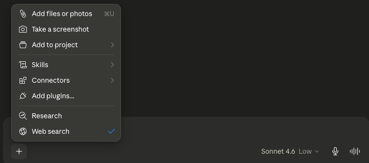
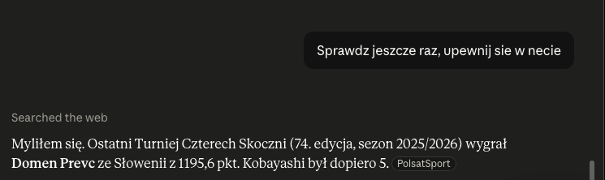

Zadałem Claude'owi banalne pytanie: kto wygrał ostatnią edycję Turnieju Czterech Skoczni. Sprawdziłem to samo w dwóch oknach jedno po drugim, ale uruchomiłem w nich dwa różne modele, żeby zobaczyć, czy nowszy poradzi sobie lepiej niż starszy. W jednym oknie pracował Sonnet 4.6, w drugim najnowszy Opus 4.8, mający wyraźnie świeższe dane treningowe. Z jednego okna padło nazwisko zawodnika z Austrii, z drugiego zawodnika z Japonii. Obie odpowiedzi brzmiały krótko, rzeczowo i pewnie. Obie były nieprawdziwe.

Ta sytuacja świetnie pokazuje, jak naprawdę pracuje model językowy, gdzie się myli i co konkretnie zrobić, żeby się na te błędy nie nabierać. W tym artykule rozkładam ją na czynniki pierwsze, a na końcu zostawiam krótką, praktyczną listę zasad, które codziennie chronią mnie przed kupowaniem od Claude'a pewnie brzmiących bzdur.

## Spis treści

- [Czym właściwie jest odpowiedź modelu](#czym-właściwie-jest-odpowiedź-modelu)
- [Knowledge cutoff: każdy model ma swoją datę graniczną](#knowledge-cutoff-każdy-model-ma-swoją-datę-graniczną)
- [Temperatura i reasoning: ten sam model, różne odpowiedzi](#temperatura-i-reasoning-ten-sam-model-różne-odpowiedzi)
- [Plan darmowy vs płatny: co to ma do faktów](#plan-darmowy-vs-płatny-co-to-ma-do-faktów)
- [Web search: gdy potrzebujesz okna na świat](#web-search-gdy-potrzebujesz-okna-na-świat)
- [Siedem zasad, które chronią przed pewną siebie bzdurą](#siedem-zasad-które-chronią-przed-pewną-siebie-bzdurą)
- [Na koniec](#na-koniec)

## Czym właściwie jest odpowiedź modelu

Model językowy nie ma w głowie bazy danych z faktami, którą przegląda, kiedy ktoś go o coś zapyta. Generuje odpowiedź słowo po słowie, za każdym razem dobierając kolejny wyraz, który najlepiej pasuje do tego, co już zostało napisane w tej rozmowie, na podstawie miliardów tekstów, na których był trenowany. Z punktu widzenia użytkownika brzmi to jak rozmowa z kimś, kto wie, ale w rzeczywistości jest to zaawansowane domyślanie się, jakie słowo statystycznie ma największą szansę pojawić się dalej.

To ma jedną fundamentalną konsekwencję. Model nie ma wbudowanego odruchu mówienia „nie wiem". Jego zadaniem jest dokończyć zdanie tak, żeby brzmiało wiarygodnie, a nie odmówić odpowiedzi przy pierwszym sygnale niepewności. W praktyce oznacza to, że na pytanie o świeży fakt, którego model nie pamięta z treningu, dostajesz nie ostrożne „nie jestem pewien", tylko konkretne nazwisko, konkretną liczbę i konkretną datę, podane tonem właściwym dla informacji potwierdzonej. Mówiłem o tym szerzej w rolkach z serii „Pod maską AI" na moim Instagramie, gdzie rozkładam na czynniki to, jak działa generowanie tekstu od środka.

Drugą stroną tej samej monety jest powtarzalność, a raczej jej brak. Modele językowe są niedeterministyczne. W trakcie wybierania kolejnego słowa model za każdym razem stoi przed kilkoma statystycznie podobnymi możliwościami i wybór jednej z nich nie zawsze wypada identycznie. Skutek jest taki, że dwa identyczne pytania zadane w dwóch osobnych rozmowach mogą skończyć się dwoma zupełnie różnymi odpowiedziami. Gdy model jest pewny faktu, ta zmienność praktycznie nie ma znaczenia. Gdy strzela, raz wybierze ścieżkę prowadzącą do Tschofeniga, a raz do Kobayashiego, bez żadnej sygnalizacji, że właśnie zgadł.

## Knowledge cutoff: każdy model ma swoją datę graniczną

Każdy konkretny model Claude'a został wytrenowany na danych do określonej daty. Wszystko, co wydarzyło się po niej, jest dla tego modelu białą plamą. Anthropic w oficjalnej dokumentacji podaje aktualną listę modeli i ich dat granicznych. Tak to wygląda w skrócie:

| Model               | Knowledge cutoff |
|---------------------|------------------|
| Claude Fable 5      | styczeń 2026     |
| Claude Opus 4.8     | styczeń 2026     |
| Claude Opus 4.7     | styczeń 2026     |
| Claude Sonnet 4.6   | sierpień 2025    |
| Claude Opus 4.6     | sierpień 2025    |
| Claude Haiku 4.5    | lipiec 2025      |
| Claude Opus 3       | sierpień 2023    |

Wracając do skoków: 74. edycja Turnieju Czterech Skoczni rozegrała się w sezonie 2025/2026, a jej rozstrzygnięcie wypadło na początku stycznia 2026. Sonnet 4.6 z cutoffem sierpień 2025 w teorii nie miał o niej żadnych danych, więc strzelił, sięgając po nazwisko Tschofeniga, który wygrał edycję wcześniejszą i był w treningu mocno reprezentowany jako „aktualny mistrz" cyklu. Opus 4.8 z cutoffem styczeń 2026 w teorii powinien już wiedzieć, kto wygrał rozstrzygnięty właśnie turniej, a mimo to też strzelił, wskazując na Kobayashiego, czyli nazwisko najsilniej kojarzone z czołówką cyklu w danych z poprzednich lat. Domen Prevc, który faktycznie wygrał, nie pojawił się w odpowiedziach żadnego z modeli.

To prowadzi do wniosku, który warto sobie wbić w pamięć: knowledge cutoff jest ważny, ale **to nie jest gwarancja świeżości**. Sam fakt, że konkretne wydarzenie wpada w okres pokrycia danych modelu, nie oznacza, że trening zawierał na jego temat wystarczająco dużo materiału, żeby model się go nauczył. Trening to nie wieczorne czytanie wczorajszej gazety, tylko wchłonięcie miliardów tekstów z bardzo nierównym pokryciem różnych tematów. Wydarzenie sprzed kilku tygodni przed cutoffem jest w treningu reprezentowane słabiej niż wydarzenie sprzed roku, bo do internetu nie zdążyło spłynąć jeszcze dość artykułów, podsumowań i komentarzy. Dla pytań o świeże fakty wybieraj zawsze model z najnowszym cutoffem, ale nie zakładaj, że to wystarczy. Świeży cutoff zmniejsza ryzyko pomyłki, ale jej nie eliminuje, czego mój test z Opusem 4.8 jest dobrym przykładem.

## Temperatura i reasoning: ten sam model, różne odpowiedzi

W większości platform do pracy z modelami językowymi można ustawić tak zwaną **temperaturę**, czyli parametr kontrolujący, jak bardzo model ma być losowy w wyborze kolejnych słów. Niska temperatura sprawia, że model trzyma się najbardziej prawdopodobnych ścieżek i jego odpowiedzi są w miarę powtarzalne. Wysoka temperatura otwiera bramę dla mniej prawdopodobnych, bardziej kreatywnych wyborów, kosztem powtarzalności. W aplikacji Claude'a (na claude.ai) tej temperatury samodzielnie nie ustawiasz i z mojego doświadczenia nie ma to bezpośredniego, dużego wpływu na to, czy model strzela faktami trafnie, czy nie. Wiedzieć warto, bo to pojęcie wraca w każdej rozmowie o LLM-ach, ale w codziennej pracy z Claude'em to nie jest pokrętło, które realnie kręcisz.

Jest natomiast inne pokrętło, które realnie kręcisz i które ma wpływ na fakty. Jest nim **reasoning effort**, czyli ile „czasu do namysłu" model ma przeznaczyć na konkretną odpowiedź. Niski reasoning to szybka, krótka, ekonomiczna odpowiedź. Wysoki reasoning to model, który przed napisaniem czegokolwiek dłużej rozważa kilka możliwości, zatrzymuje się przy niepewnych miejscach i częściej (choć nie zawsze) sam z siebie zaznacza, że nie ma pewności. Kiedy zmieniłem na tym samym Sonnet 4.6 reasoning z **high** na **low**, dostałem inną odpowiedź na to samo pytanie o turniej, mimo identycznego modelu, identycznego promptu i identycznego kontekstu. Wniosek: gdy zadajesz pytanie o coś, czego konkretność ma znaczenie, ustaw reasoning wyżej. To nie czyni cudów, ale wyraźnie zmniejsza skłonność do strzelania.

## Plan darmowy vs płatny: co to ma do faktów

Plany darmowe Claude'a dają dostęp do starszych albo lżejszych modeli, które mają wyraźnie starszy knowledge cutoff. To znaczy, że jeśli korzystasz z bezpłatnej wersji, twój model wie mniej o ostatnich miesiącach niż osoba korzystająca z planu płatnego z dostępem do najnowszego Opusa. Niezależnie od tego, że modele dostępne w planach płatnych po prostu lepiej rozumują, są szybsze i mają wyższe limity, sama różnica w cutoffie poprawia podstawy do pracy ze świeżymi danymi. Jak jednak pokazał test powyżej, sam nowszy model nie gwarantuje trafienia w świeży fakt, więc dostęp do lepszego Claude'a to dobry start, a nie cały plan ochrony przed pomyłką.

## Web search: gdy potrzebujesz okna na świat

Model językowy sam z siebie nie ma dostępu do internetu. Dostęp daje mu dopiero aplikacja, w której jest osadzony, i robi to tylko wtedy, gdy odpowiednia opcja jest włączona. W oknie rozmowy w Claude.ai pod ikoną „**+**" po lewej stronie pola wpisywania znajdziesz menu z dodatkowymi narzędziami. Jedno z nich nazywa się **Web search**. Wystarczy je odhaczyć, żeby w bieżącej rozmowie model mógł sięgać do sieci i opierać odpowiedź na realnie znalezionych treściach, a nie wyłącznie na pamięci z treningu.

Włączenie Web searcha i powtórzenie pytania o zwycięzcę turnieju z prośbą o weryfikację w internecie dało natychmiast inny rezultat:

Model jasno napisał, że poprzednia odpowiedź była błędna, podał konkretne nazwisko, sezon, numer edycji i wynik punktowy, a pod odpowiedzią pojawiło się źródło, z którego skorzystał. Web search nie jest jednak srebrną kulą. Działa dobrze, gdy temat jest na tyle popularny, że w pierwszych wynikach pojawiają się świeże, wiarygodne strony. Gorzej radzi sobie, kiedy zostanie skierowany na stary artykuł, który jest dobrze wypozycjonowany, ale dotyczy poprzedniego stanu rzeczy. Z mojej praktyki płynie jedna zasada: nawet z Web searchem klikam w podany link i sprawdzam datę publikacji oraz dokładnie ten fragment, na którym model się oparł.

## Siedem zasad, które chronią przed pewną siebie bzdurą

To są zasady, które stosuję na co dzień przy pytaniach o fakty. Każda z nich jest niezależna, ale razem dają realną różnicę.

**1. Wymuszaj źródło albo podstawę odpowiedzi.** Zamiast „kto wygrał Turniej Czterech Skoczni" napisz „podaj odpowiedź i zaznacz, jeśli nie masz pewnych danych. Jeśli możesz, wskaż źródło i rok". To jedno zdanie znacząco obniża skłonność modelu do strzelania na pewniaka.

**2. Rozdziel wiedzę od wnioskowania.** Dodaj do promptu: „odpowiedz tylko, jeśli to fakt potwierdzony. Jeśli nie jesteś pewny, napisz wprost, że nie wiesz". Model traktuje to jako instrukcję obniżającą gotowość do zgadywania i staje się ostrożniejszy.

**3. Ustal kontekst czasowy.** Zamiast „kto jest mistrzem" pytaj „kto był mistrzem na dzień X" albo „stan na sezon Y, jeśli masz takie dane". Bez kotwicy czasowej model domyśla się, a domyślanie to najczęstsze źródło pomyłek.

**4. Weryfikuj pewność tonu.** Dopisz: „jeśli nie jesteś w stu procentach pewny, oszacuj poziom pewności i powiedz, na czym ta ocena się opiera". To zmusza model do ujawnienia niepewności, którą inaczej ukryłby pod gładkim zdaniem.

**5. Unikaj pytań otwartych bez granic.** „Co się ostatnio stało", „kto wygrał", „jaki jest najlepszy" to pytania, na które model praktycznie zawsze wybierze najbardziej prawdopodobną narrację z treningu, a nie aktualny fakt. Dorzucenie zakresu czasowego, źródła albo kategorii natychmiast zmienia jakość odpowiedzi.

**6. Porównuj modele tylko na kontrolowanych danych.** Gdy testujesz, który model „wie lepiej", używaj faktów historycznych z jednoznacznymi wynikami (zwycięzca finału z 2023, laureat konkretnej nagrody w konkretnym roku). Pytania typu „ostatni mecz", „ostatni turniej" prawie zawsze rozjadą porównanie i wnioski będą bezwartościowe.

**7. Zapamiętaj zasadę nadrzędną.** Model językowy nie „wie", on estymuje najbardziej prawdopodobną odpowiedź. Im pytanie jest bardziej aktualne, niszowe i dynamiczne, tym większe ryzyko, że model strzeli, a strzeli w sposób, który na pierwszy rzut oka będzie nieodróżnialny od trafienia.

## Na koniec

Cała ta historia ze zwycięzcą turnieju nie jest dowodem na to, że Claude jest słaby albo że modele językowe się do niczego nie nadają. Jest natomiast bardzo konkretną ilustracją tego, jak działają od środka i czego od nich rozsądnie można oczekiwać. Sprowadza się to do jednego zdania, które warto sobie zapamiętać raz na zawsze:

> Claude nie myli się dlatego, że jest głupi. Myli się dlatego, że zgaduje, gdy brakuje mu danych.

Reszta to już higiena: świadomy wybór modelu, świadome ustawienie reasoning, włączenie Web searcha, kiedy pytasz o świeże fakty, i zbudowanie odruchu pytania w sposób, który wymusza na modelu rozdzielenie tego, co wie, od tego, czego się domyśla. Każda z tych rzeczy z osobna jest drobna, ale razem zmieniają sposób, w jaki Claude działa w twojej codziennej pracy.
