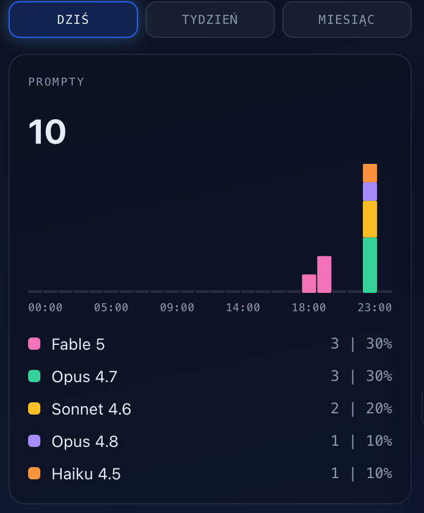
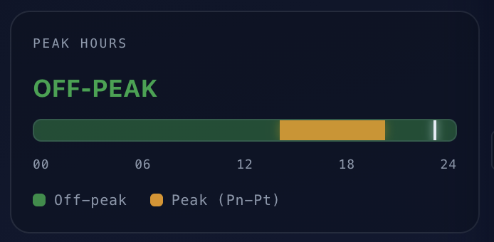
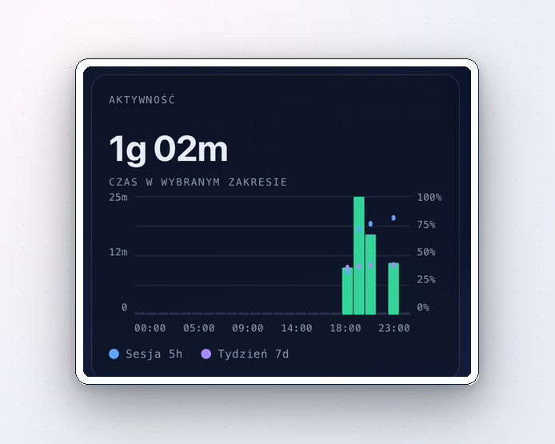
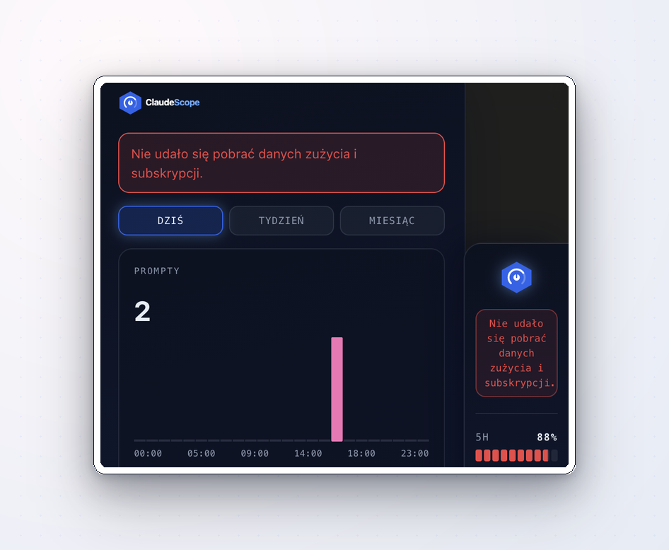

Znasz to uczucie, kiedy w połowie ważnej rozmowy z Claude'em okazuje się, że właśnie wyczerpałeś limit i musisz czekać kilka godzin na reset? Gdybyś wiedział dziesięć minut wcześniej, że jesteś blisko końca puli, przełączyłbyś się na tańszy model albo zmniejszył effort i dociągnął rozmowę do końca. A może po prostu chciałbyś obserwować własne wzorce: które prompty zjadają najwięcej tokenów, kiedy w ciągu doby tracisz limit najszybciej.

Po to powstała **ClaudeScope**. To darmowa wtyczka, która siedzi przyklejona do okna claude.ai i pokazuje na bieżąco, ile zostało Ci 5-godzinnego limitu, ile tygodniowego, kiedy się odnowią i czy akurat trafiłeś na godziny szczytu. W tym artykule pokażę, co dokładnie mierzy i jak to wygląda.

## Spis treści

- [Panel boczny: wszystko, co musisz wiedzieć, w jednym miejscu](#panel-boczny-wszystko-co-musisz-wiedzieć-w-jednym-miejscu)
- [Prompty według modelu: gdzie kończą się Twoje zapytania](#prompty-według-modelu-gdzie-kończą-się-twoje-zapytania)
- [Limity sesji: ile, do kiedy, kiedy się odnowi](#limity-sesji-ile-do-kiedy-kiedy-się-odnowi)
- [Subskrypcja: zanim zapłacisz znowu](#subskrypcja-zanim-zapłacisz-znowu)
- [Peak hours: kiedy unikać ciężkich promptów](#peak-hours-kiedy-unikać-ciężkich-promptów)
- [Aktywność: jak naprawdę pracujesz z Claude'em](#aktywność-jak-naprawdę-pracujesz-z-claudeem)
- [Komunikaty: gdy coś idzie nie tak](#komunikaty-gdy-coś-idzie-nie-tak)
- [Prywatność i bezpieczeństwo](#prywatność-i-bezpieczeństwo)
- [Jak zainstalować](#jak-zainstalować)
- [Na koniec](#na-koniec)

## Panel boczny: wszystko, co musisz wiedzieć, w jednym miejscu

Panel jest wąski i nie zasłania rozmowy. Od góry do dołu pokazuje:

- **Limit 5-godzinny**: pasek z procentem i licznikiem do resetu.
- **Limit tygodniowy**: to samo, tylko dla puli 7-dniowej.
- **Cykl subskrypcji**: kółko z procentem zużycia okresu rozliczeniowego i licznikiem dni.
- **Czas aktywności**: ile dziś spędziłeś z Claude'em. Licznik chodzi tylko gdy karta jest aktywna, więc nie nakręca się w tle.
- **Wskaźnik peak hours**: świeci, kiedy jesteś w godzinach szczytu.
- **Strzałka po lewej**: zwija panel do wąskiego paska, jeśli akurat potrzebujesz miejsca.
- **Ikona wykresu na dole**: otwiera panel szczegółowy z czterema osobnymi sekcjami. Tam dzieje się cała analityka.

## Prompty według modelu: gdzie kończą się Twoje zapytania

Pierwsza sekcja panelu szczegółowego pokazuje, ile procent Twoich promptów poszło do Opusa, ile do Sonneta, ile do Haiku. Brzmi jak ciekawostka, ale uczy konkretu: jeśli 80% Twoich zapytań to proste pytania, a wszystkie idą do Opusa, to marnujesz limit. Sonnet zrobi to samo i taniej.

Na górze wybierasz zakres danych: **dziś**, **ostatni tydzień**, **ostatni miesiąc**. Ten sam wybór działa we wszystkich sekcjach szczegółowego widoku.

## Limity sesji: ile, do kiedy, kiedy się odnowi

Sekcja **LIMITY** to to samo, co paski na panelu bocznym, tylko z konkretami: procent zużycia 5-godzinnego, procent zużycia 7-dniowego, dokładna data i godzina najbliższego resetu, czas pozostały do tego momentu. Jeśli planujesz dłuższą sesję na wieczór, jednym spojrzeniem wiesz, czy się zmieścisz.

## Subskrypcja: zanim zapłacisz znowu

Sekcja **SUBSKRYPCJA** podaje datę odnowienia, liczbę dni do końca cyklu i status płatności. Brzmi jak drobiazg, ale potrafi uratować przed dwoma niespodziankami.

Pierwsza: płatność nie przejdzie, bo karta wygasła albo na koncie nie ma środków. Wtedy Claude przestaje działać bez ostrzeżenia, w środku tygodnia pracy. Druga: chcesz odpiąć subskrypcję, ale masz jeszcze niedokończone zadanie. Widzisz „zostały trzy dni" i planujesz tak, żeby zdążyć zamknąć temat przed wygaśnięciem.

## Peak hours: kiedy unikać ciężkich promptów

Anthropic potwierdziło, że są godziny, w których ten sam prompt zżera więcej z puli. Sekcja **PEAK HOURS** rysuje rozkład doby z zaznaczonymi takimi pasmami. Zwróć uwagę, że strefy przesuwają się razem ze zmianą czasu letni/zimowy, więc wtyczka uwzględnia to po Twojej stronie.

Reguła jest prosta: nie chodzi o to, żeby w peak hours nie pisać. Chodzi o to, żeby na ten czas nie planować ciężkich promptów z dużym kontekstem, długimi załącznikami albo wysokim effortem. Lekkie pytania puszczaj kiedy chcesz.

## Aktywność: jak naprawdę pracujesz z Claude'em

Sekcja **AKTYWNOŚĆ** to wykres z dwiema osiami. Lewa oś pionowa to czas spędzony z Claude'em, prawa to procent wykorzystania limitów. Słupki pokazują, jak długo siedziałeś w danym przedziale czasu, a małe kropki nad nimi to dwa Twoje limity: **5-godzinny** i **7-dniowy**.

Po najechaniu na konkretną kropkę zobaczysz ostatnią odczytaną wartość limitu z tego momentu, czyli ile zostało Ci puli, kiedy ClaudeScope sprawdzał. Z czasem kropki układają się w krzywą rosnącą. Tak właśnie wygląda Twój dzień (albo tydzień) od strony wyczerpywania limitu.

Nad wykresem masz przełącznik na trzy zakresy: **dziś**, **ostatni tydzień**, **ostatni miesiąc**. Po kilku dniach używania zaczniesz widzieć własne wzorce: kiedy wpadasz w limit, w jakich godzinach pracujesz najciężej, kiedy odpuszczasz.

## Komunikaty: gdy coś idzie nie tak

Wtyczka odświeża dane co kilkanaście sekund. Jeśli z jakiegoś powodu nie uda jej się pobrać aktualnych liczb, mówi o tym wprost.

Ostatnia znana wartość zostaje na ekranie (żebyś nie patrzył w puste pole), wtyczka próbuje połączyć się ponownie w tle, a kolor komunikatu mówi o wadze: niebieski to informacja, żółty to ostrzeżenie, czerwony to błąd. Tym samym kanałem dostajesz też powiadomienia od autora wtyczki, np. o nowych wersjach.

## Prywatność i bezpieczeństwo

To dla mnie najważniejszy punkt. ClaudeScope:

- ma dostęp **wyłącznie do claude.ai**, do żadnej innej strony,
- liczy wszystko **lokalnie w Twojej przeglądarce**, żadne dane nie wychodzą na zewnętrzny serwer,
- nie wymaga konta, logowania ani rejestracji.

Uprawnienia, które wtyczka deklaruje przy instalacji, są dokładnie tym, co opisałem powyżej. Możesz je sprawdzić w ustawieniach przeglądarki w każdej chwili.

Sam kod wtyczki też nie jest „weź na słowo". ClaudeScope przeszła oficjalną weryfikację zarówno w **Chrome Web Store**, jak i w **Mozilla Add-ons**. Oba sklepy prowadzą surowy proces audytu bezpieczeństwa: sprawdzają, jakie uprawnienia rozszerzenie naprawdę wykorzystuje, czy nie wysyła danych w nieoczywiste miejsca, czy kod nie zawiera obfuskacji ani podejrzanych zewnętrznych zależności. Dopiero rozszerzenie, które przejdzie ten audyt, trafia do sklepu z zielonym światłem.

## Instalacja

Najpierw jedno zastrzeżenie: ClaudeScope to wtyczka **wyłącznie do przeglądarki**. Nie działa w aplikacji desktopowej Claude'a zainstalowanej na komputerze, ani w aplikacji mobilnej. Wtyczka nie ingeruje też w żaden sposób w kod aplikacji dostarczanej przez Anthropic, tylko czyta dane, które i tak Twoja przeglądarka pobiera z claude.ai.

### Chrome i przeglądarki Chromium (Edge, Brave, Opera, Vivaldi, Arc)

Dla użytkowników Chrome'a i wszystkich przeglądarek opartych na Chromium (Microsoft Edge, Brave, Opera, Vivaldi, Arc) wtyczka przeszła weryfikację w **Chrome Web Store**, czyli oficjalnym sklepie wtyczek Google. Znajdziesz ją pod tym linkiem:

[ClaudeScope w Chrome Web Store](https://chromewebstore.google.com/detail/bghocpfpcbbmodnhlcddihdalgekpdaa)

Wystarczy kliknąć **„Dodaj do Chrome"**, a następnie wejść na [claude.ai](https://claude.ai) (lub odświeżyć istniejące okno rozmowy z Claude'em). W ciągu kilkudziesięciu sekund wtyczka załaduje dane dotyczące Twojego konta i panel boczny pojawi się przy oknie rozmowy.

### Firefox i przeglądarki pochodne

Dla użytkowników Firefoxa wtyczka przeszła weryfikację w **Mozilla Add-ons**, czyli oficjalnym sklepie dodatków Mozilli. Znajdziesz ją pod tym linkiem:

[ClaudeScope w Mozilla Add-ons](https://addons.mozilla.org/pl/firefox/addon/claudescope/)

Wystarczy kliknąć **„Dodaj do Firefoksa"**, a następnie wejść na [claude.ai](https://claude.ai) (lub odświeżyć istniejące okno rozmowy z Claude'em). W ciągu kilkudziesięciu sekund wtyczka załaduje dane dotyczące Twojego konta i panel boczny pojawi się przy oknie rozmowy.

### Safari

Na ten moment ClaudeScope **nie wspiera Safari**. Powód jest prozaiczny: żeby udostępnić wtyczkę użytkownikom Safari w przystępny sposób (czyli oficjalną drogą przez App Store), trzeba opłacić konto developerskie Apple - 100 dolarów rocznie. Jeśli zainteresowanie będzie większe, wrócę do tematu w przyszłości.

## Na koniec

To tyle. Zainstaluj, popatrz przez kilka dni, zobacz własne wzorce zużycia limitu. Miłego użytkowania i mądrego wykorzystywania swoich limitów.
