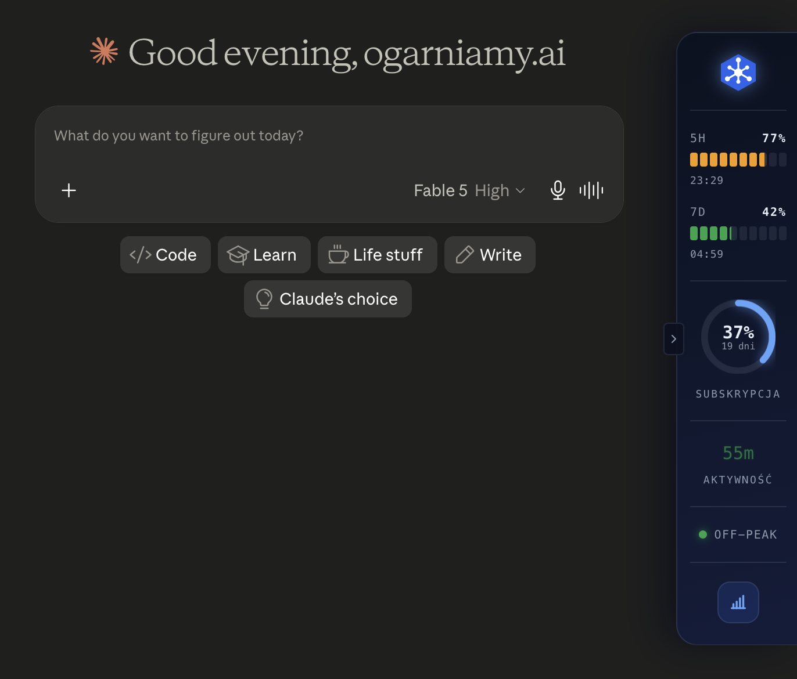
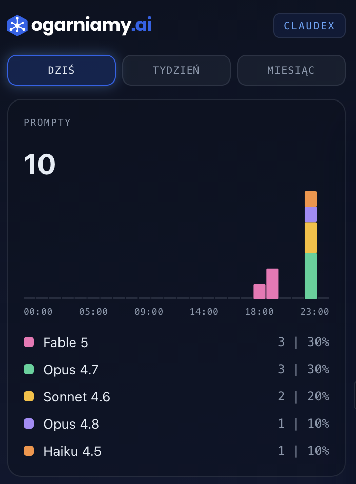
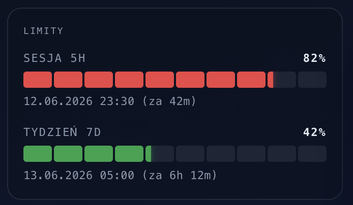
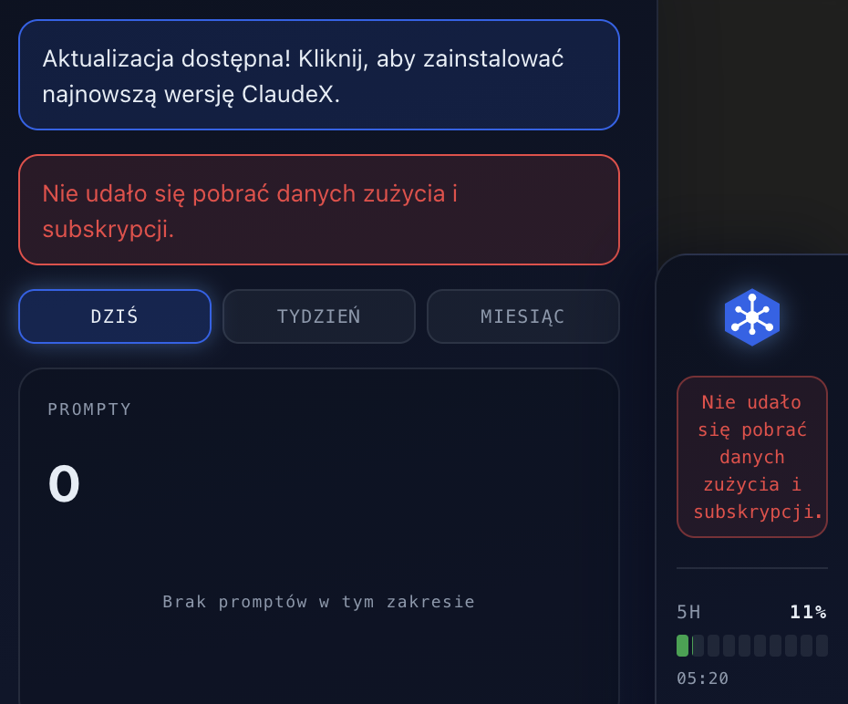

Piszesz z Claude, idzie Wam dobrze, a tu nagle czerwony komunikat: „osiągnąłeś limit, wróć za kilka godzin". Tylko jakich kilka? Trzy? Pięć? I czy to ten 5-godzinny, czy może wpadłeś już w tygodniowy? Subskrypcja kosztuje konkretne pieniądze, a Claude.ai nie pokazuje wprost, ile z niej zużyłeś.

W tym artykule pokażemy darmową wtyczkę **ClaudeX**, którą zrobiliśmy właśnie po to, żeby ten moment „limit" już nigdy Cię nie zaskoczył. Zobaczysz, co dokładnie wtyczka mierzy, jak to wygląda na ekranie i dlaczego możesz jej zaufać.

## Po co komu wtyczka, skoro Claude sam pokazuje pasek?

Bo pokazuje go za późno i nie cały. Anthropic informuje Cię o limicie dopiero, kiedy zostało Ci 20%. Wcześniej nie wiesz nic. Nie wiesz też:

- ile dni zostało do końca cyklu rozliczeniowego subskrypcji,
- czy akurat jesteś w godzinach szczytu (peak hours), w których jeden prompt zżera więcej z puli,
- ile czasu w ogóle spędziłeś dziś z Claude'em,
- którego modelu używasz najczęściej.

ClaudeX dokłada to wszystko w jedno miejsce, przyklejone do prawej krawędzi okna. Nie musisz nic klikać, nie musisz odświeżać.

## Co dokładnie widzisz na panelu bocznym

Panel jest mały i nie zasłania rozmowy. Od góry do dołu pokazuje:

- **Limit 5-godzinny**: pasek z procentem i licznikiem do resetu.
- **Limit tygodniowy**: ten sam patent, tylko dla puli 7-dniowej.
- **Cykl subskrypcji**: ile dni zostało do odnowienia. Gdy zbliża się koniec, dostajesz delikatne ostrzeżenie.
- **Czas aktywności**: licznik czasu spędzonego dziś z Claude'em. Liczy tylko gdy karta jest aktywna, więc nie nakręcasz go w tle.
- **Wskaźnik peak hours**: świeci, kiedy jesteś w godzinach szczytu.
- **Strzałka po lewej**: zwija panel do wąskiego paska, jeśli akurat potrzebujesz miejsca.

Wszystko liczy się lokalnie w Twojej przeglądarce. Nic nie wychodzi na żaden serwer (jeszcze do tego wrócimy).

## Panel szczegółowy: gdzie kończą się Twoje prompty

Po kliknięciu ikony wykresu otwiera się szerszy panel z czterema sekcjami. Pierwsza to **rozkład promptów według modelu**.

Widzisz, ile procent Twoich zapytań poszło do Opusa, ile do Sonneta, ile do Haiku. Brzmi jak ciekawostka, ale w praktyce uczy: jeśli 80% Twoich zapytań to proste pytania, a wszystkie idą do Opusa, marnujesz limit. Sonnet zrobi to samo i taniej.

## Limity sesji: ile, do kiedy, na kiedy się odnowi

Sekcja **LIMITY** to to samo co paski na panelu bocznym, tylko z konkretami: procent wykorzystania 5-godzinnego, procent wykorzystania 7-dniowego, dokładna data i godzina najbliższego resetu, czas pozostały do tego momentu. Jeśli planujesz pracę z Claude'em na wieczór, jednym spojrzeniem wiesz, czy się zmieścisz.

## Subskrypcja: kiedy zapłacisz znowu

Sekcja **SUBSKRYPCJA** podaje nazwę planu, datę odnowienia, liczbę dni do końca cyklu i status płatności. Drobiazg, ale potrafi uratować przed niespodzianką: „o, Claude mi się resetuje za dwa dni, zostawię tę ciężką sesję na piątek".

## Peak hours: kiedy nie pisać

Sekcja **PEAK HOURS** to rozkład doby z zaznaczonymi godzinami szczytu. Anthropic potwierdziło, że w tych godzinach prompty zużywają więcej z puli. Jeśli zależy Ci na limicie, planuj cięższe sesje poza żółtymi strefami. To jest realna oszczędność, nie żadna magia.

## Aktywność: jak naprawdę pracujesz z Claude'em

Sekcja **AKTYWNOŚĆ** pokazuje historię: łączny czas spędzony z Claude'em oraz procent wykorzystania sesji w poszczególnych momentach. Możesz przełączać widok dziennie, tygodniowo, miesięcznie. Po tygodniu używania zaczniesz widzieć własne wzorce, kiedy wpadasz w limit, kiedy odpuszczasz.

## Komunikaty: gdy coś idzie nie tak

Wtyczka odświeża dane średnio co 15 sekund. Jeśli z jakiegoś powodu nie uda jej się pobrać aktualnych liczb, mówi Ci o tym wprost.

Ostatnia znana wartość zostaje na ekranie (żebyś nie patrzył na puste pole), wtyczka próbuje połączyć się ponownie w tle, a komunikat zmienia kolor zależnie od wagi: niebieski to informacja, żółty to ostrzeżenie, czerwony to błąd. Dostajesz też powiadomienia od autora wtyczki, np. o nowych wersjach.

## A co z prywatnością?

Tu jest punkt, który dla nas był najważniejszy. ClaudeX:

- ma dostęp **wyłącznie do claude.ai**, do żadnej innej strony,
- liczy wszystko **lokalnie w Twojej przeglądarce**,
- **nie wysyła** żadnych danych na zewnętrzne serwery,
- nie wymaga konta, logowania ani rejestracji.

Co więcej, kod jest publicznie widoczny na GitHubie. Każdy, kto się zna, może sprawdzić, że naprawdę nic nie wycieka. To nie jest open source w sensie „rób co chcesz", ale jest transparentny w sensie „możesz zobaczyć każdy bajt".

## Jak to zainstalować

Wtyczka działa w Chrome, Edge, Brave, Opera, Vivaldi, Arc i Firefoksie. Pełna instrukcja krok po kroku jest w [repozytorium na GitHubie](https://github.com/ogarniamyai/claudex), razem z linkami do najnowszych paczek. W skrócie:

- **Chromium** (Chrome i pochodne): pobierz `.zip`, rozpakuj, włącz tryb dewelopera w `chrome://extensions`, kliknij „Załaduj rozpakowane".
- **Firefox**: pobierz `.xpi`, przeciągnij na okno Firefoksa, potwierdź.

Po instalacji wystarczy otworzyć claude.ai, panel pojawi się sam.

## Co dalej

Jeśli płacisz za Claude'a, a regularnie wpadasz w limit w środku ważnej rozmowy, ClaudeX zwróci Ci ten miesiąc subskrypcji w pierwszym tygodniu. Zainstaluj, popatrz przez kilka dni, zobacz własne wzorce. Potem już sam zaczniesz przesuwać cięższe rzeczy poza peak hours.

Jak będziesz mieć uwagi albo pomysły na to, czego we wtyczce brakuje, daj znać przez [issues na GitHubie](https://github.com/ogarniamyai/claudex/issues). Czytamy każde.
