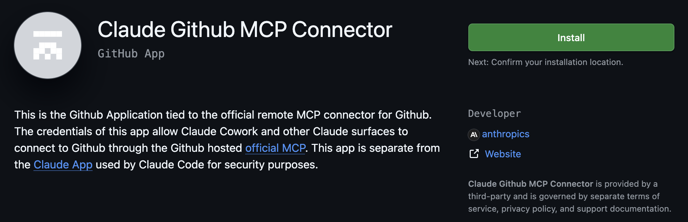
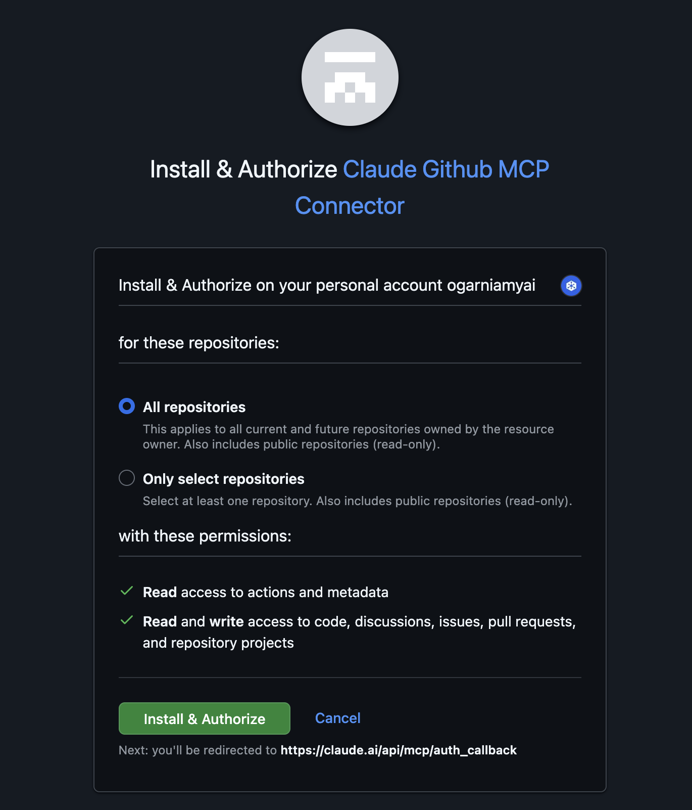
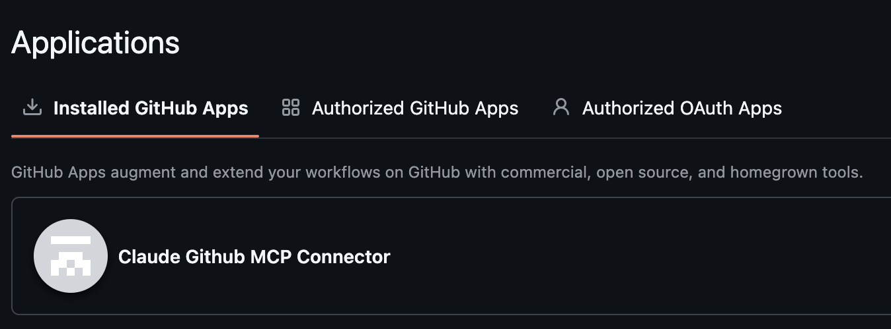
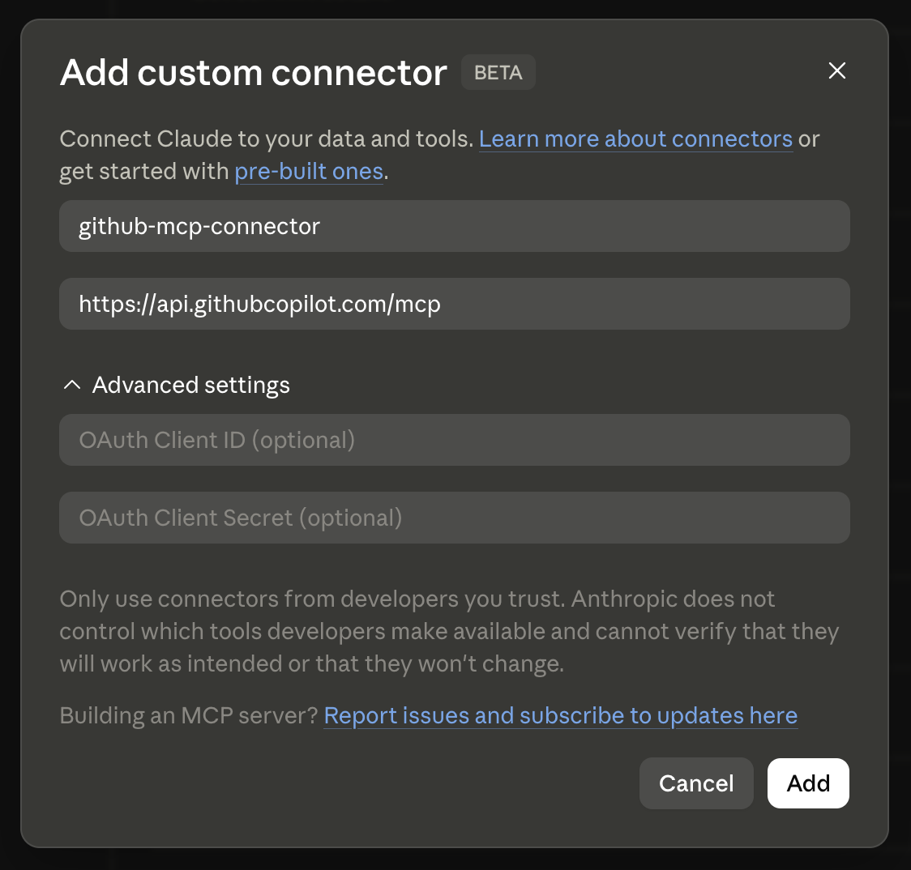
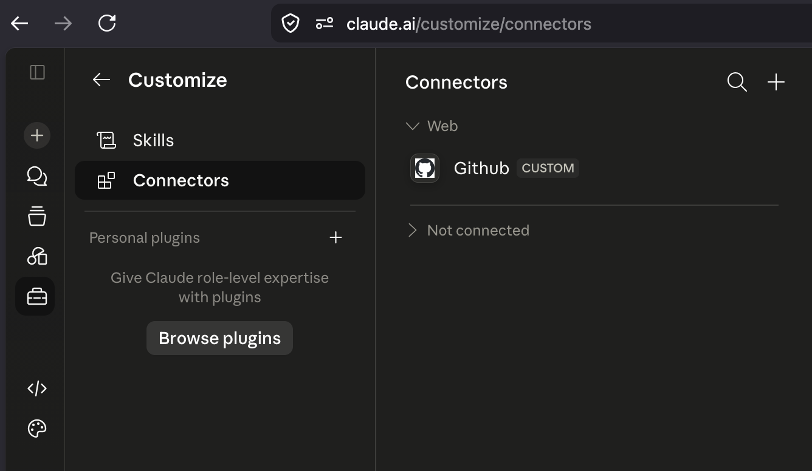
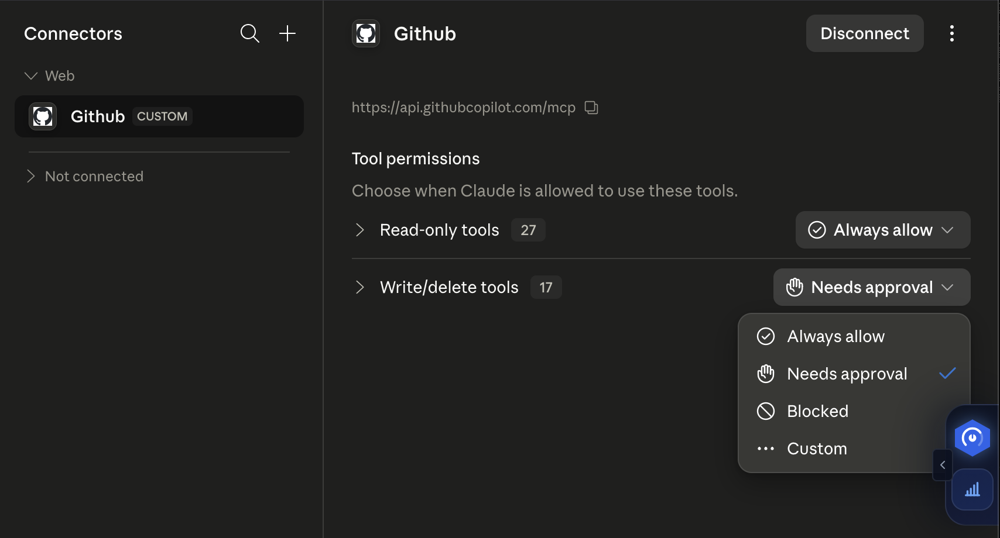
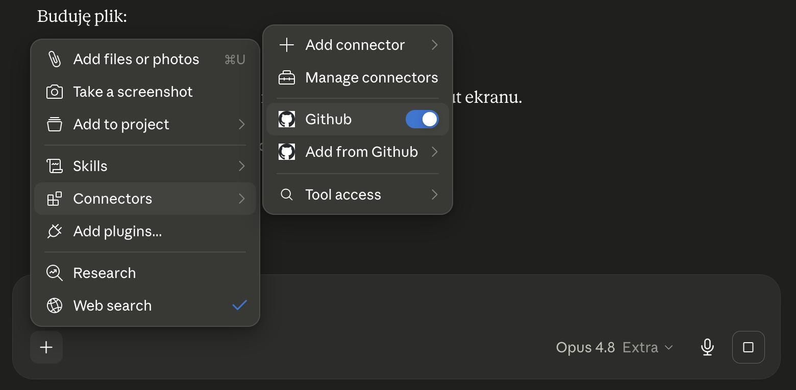
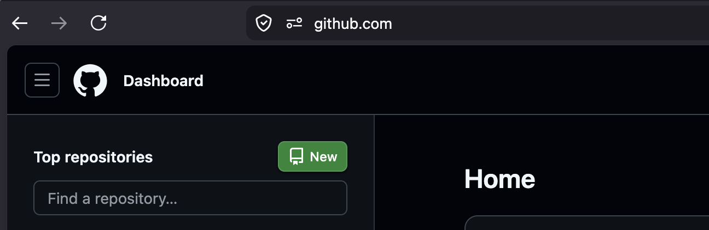
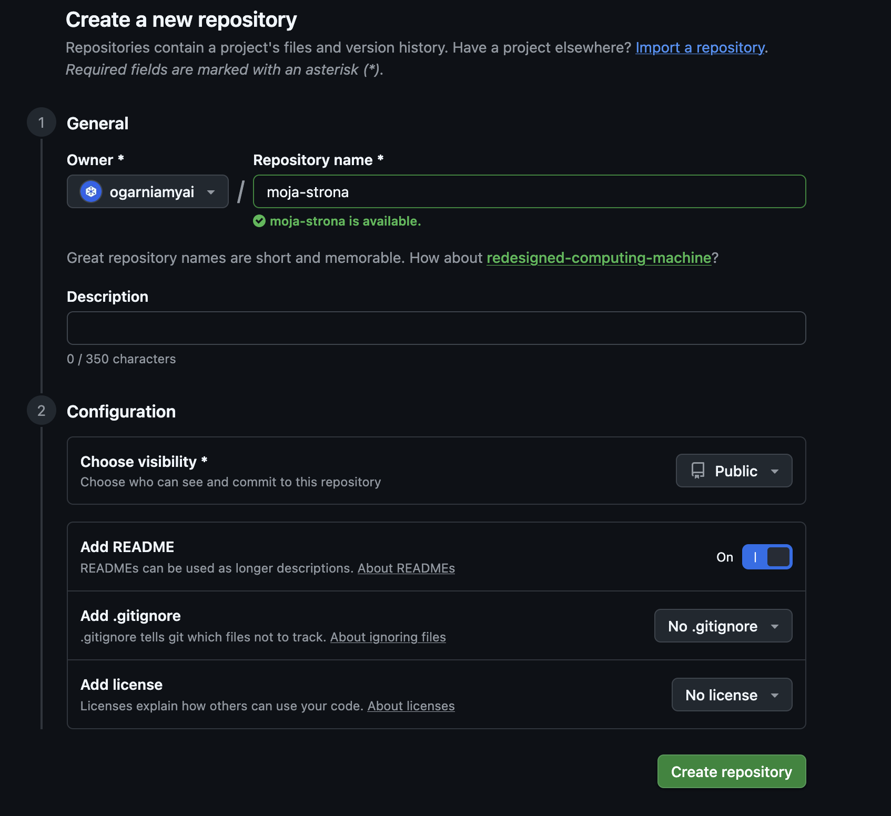
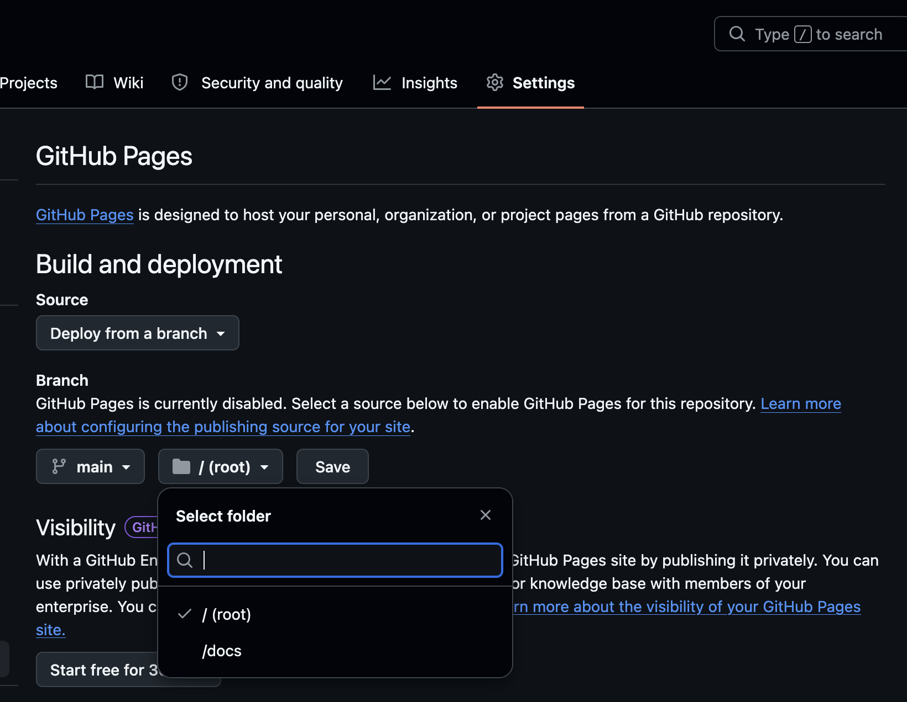

Internet stoi otworem dla każdego, ale wielu ludzi nadal myśli, że własna strona to projekt na tygodnie, programista i opłaty za hosting. To nieprawda. W tym artykule pokażę Ci, jak w jeden wieczór zrobić sobie stronę-wizytówkę, która naprawdę robi wrażenie, bez pisania kodu i bez wydania ani złotówki.

Cała sztuczka opiera się na dwóch narzędziach. AI (Claude), który napisze za nas plik strony. I GitHub Pages, który ją darmowo opublikuje pod ładnym adresem. Dzięki integracji do GitHuba (tzw. MCP connector) Claude wgra gotowy plik strony bezpośrednio do Twojego repozytorium, bez ściągania go na dysk i ręcznego uploadu. Samo repozytorium i opcję GitHub Pages włączasz sam w kilku minutach klikania.

## Spis treści

- [Co dostaniesz na koniec](#co-dostaniesz-na-koniec)
- [Co musisz mieć](#co-musisz-mieć)
- [Podłącz Claude do GitHuba](#podłącz-claude-do-githuba)
- [Załóż repozytorium i włącz GitHub Pages](#załóż-repozytorium-i-włącz-github-pages)
- [Napisz porządny brief dla AI](#napisz-porządny-brief-dla-ai)
- [Przykład dobrego briefu, wzoruj się](#przykład-dobrego-briefu-wzoruj-się)
- [Wyślij brief do Claude i pozwól mu pracować](#wyślij-brief-do-claude-i-pozwól-mu-pracować)
- [Co dalej](#co-dalej)

## Co dostaniesz na koniec

Stronę z wbudowanymi animacjami, sekcjami i responsywnością na telefon. Bez logowania, bez backendu, bez bazy danych. Czysta, szybka strona, którą sam potem edytujesz z Claude.

Strona będzie dostępna pod adresem `https://<twojlogin>.github.io`, gdzie `<twojlogin>` to dokładnie nazwa Twojego konta na GitHubie. To ważne, bo Twój login z GitHuba pojawi się w adresie strony. Login wybierasz przy zakładaniu konta, ale możesz go zmienić później w `Settings → Account → Change username` (zmiana przepisuje też adres strony). Jeśli planujesz stronę firmową, warto już na starcie założyć konto pod nazwą firmy.

Jeśli wolisz własny, „prawdziwy" adres typu `firmaxyz.pl`, da się go podpiąć później pod tę samą stronę za pomocą opcji **Custom domain** w ustawieniach repozytorium. Strona dalej będzie hostowana za darmo na GitHubie, ale wyświetli się pod Twoją domeną. Napiszę pod to osobny artykuł.

Nie ma znaczenia, czy robisz wizytówkę firmy, portfolio, stronę projektu czy menu restauracji. Schemat jest dokładnie ten sam.

## Co musisz mieć

Trzy rzeczy, wszystkie darmowe:

- Konto na **GitHubie** (jeśli nie masz, załóż na github.com).
- Konto w **Claude** (claude.ai, wystarczy plan darmowy).
- Pomysł na to, co ma być na stronie.

## Podłącz Claude do GitHuba

To robisz raz. Potem już zapominasz o tym kroku i przy każdej kolejnej stronie zaczynasz od razu od opisywania pomysłu.

### 1. Zainstaluj aplikację Claude GitHub MCP Connector

Wejdź na adres `https://github.com/apps/claude-github-mcp-connector` (alternatywnie wpisz „Claude GitHub MCP Connector" w wyszukiwarkę GitHub Apps). Kliknij **Install**.



### 2. Autoryzuj na swoim koncie

GitHub zapyta, do których repozytoriów dać Claude dostęp. Najwygodniej wybrać **All repositories**, bo wtedy nie musisz tego klikać przy każdej kolejnej stronie. Jeśli wolisz większą kontrolę, możesz dać dostęp tylko do wskazanych.



Po kliknięciu **Install & Authorize** zobaczysz aplikację na liście zainstalowanych. Sprawdzisz to klikając w ikonę swojego profilu w prawym górnym rogu GitHuba, potem **Settings → Applications**. Connector powinien być na liście **Installed GitHub Apps**.



### 3. Dodaj connector w Claude

Teraz po stronie Claude. Wchodzisz na `claude.ai/customize/connectors` i klikasz **+ Add custom connector**.

W okienku, które się otworzy, wpisz nazwę (np. `github-mcp-connector`) i adres serwera MCP, czyli `https://api.githubcopilot.com/mcp`. Reszta pól może zostać pusta.



Klikasz **Add**. Connector pojawi się na liście Twoich connectorów w Claude.



### 4. Ustaw uprawnienia narzędzi

Otwórz dodany connector. Zobaczysz dwie grupy uprawnień. **Read-only tools** (czytanie repozytoriów) i **Write/delete tools** (commitowanie i edycja plików). Oba ustaw na **Always allow**, żeby Claude mógł wgrywać i poprawiać pliki w Twoim repozytorium bez pytania o zgodę przy każdej operacji.



### 5. Włącz connector w okienku rozmowy

Connector jest dodany, ale czasami trzeba go jeszcze ręcznie włączyć w danym czacie. W oknie rozmowy z Claude kliknij przycisk **+** po lewej stronie pola tekstowego. W menu wybierz **Connectors**, a potem przełącz **Github** na ON.



Od tej chwili Claude widzi Twoje repozytoria i może wgrywać do nich pliki bezpośrednio z czatu.

> **Ważne, czego Claude NIE zrobi.** Connector pozwala wgrywać i edytować pliki w istniejących repozytoriach, ale Claude **nie utworzy za Ciebie nowego repo** ani **nie włączy GitHub Pages**. Te dwie rzeczy musisz zrobić ręcznie w przeglądarce. To prosta klikanka, dokładnie pokażę ją niżej.

## Załóż repozytorium i włącz GitHub Pages

Zanim zaczniesz pisać brief do Claude, musisz mieć przygotowane miejsce, do którego on wgra plik strony. To dwa krótkie kliknięcia po stronie GitHuba.

### Utwórz nowe repozytorium

Na GitHubie kliknij `+` w prawym górnym rogu i wybierz **New repository**.



W polu nazwy wpisz `twojlogin.github.io`, gdzie `twojlogin` to dokładnie Twój login z GitHuba. Np. jeśli logujesz się jako `kowalski`, repozytorium nazwij `kowalski.github.io`. Ta nazwa to nie kosmetyka, tylko twardy warunek GitHuba: tylko repo o nazwie `<login>.github.io` jest publikowane pod głównym adresem `https://twojlogin.github.io`. Jeśli nazwiesz repo inaczej (np. `moja-strona`), strona też się opublikuje, ale pod ścieżką `https://twojlogin.github.io/moja-strona`, czyli z dopiskiem nazwy repo na końcu.

Ustaw widoczność na **Public**, inaczej GitHub Pages nie opublikuje strony (w planie darmowym). Zaznacz też **Add a README file** — repo musi mieć w sobie chociaż jeden commit, żeby GitHub Pages dało się włączyć w następnym kroku. README to ten jeden commit. Resztę pól zostaw bez zmian i kliknij **Create repository**.



### Włącz GitHub Pages

W świeżo utworzonym repozytorium przejdź do zakładki **Settings**, a w menu po lewej wybierz **Pages**. W sekcji **Build and deployment** ustaw **Source** na *Deploy from a branch*, **Branch** na `main` i folder `/ (root)`. Kliknij **Save**.



Repozytorium jest jeszcze puste (poza README), ale GitHub wie już, że ma publikować jego zawartość pod adresem `https://twojlogin.github.io`. Plik strony wleci tam za chwilę z Claude.

> **Wskazówka, jeśli planujesz użyć własnych zdjęć.** Claude wgrywa pliki przez MCP w postaci tekstu (base64), więc przy większych obrazkach (powyżej ~1 MB) potrafi się zaciąć lub odmówić uploadu. Najwygodniej jest wrzucić takie zdjęcia ręcznie. W repozytorium kliknij **Add file → Upload files**, przeciągnij obrazki do folderu (np. `assets/`) i daj **Commit changes**. Potem w briefie po prostu napisz Claude, że obrazki są już w repo pod ścieżkami `assets/nazwa.jpg` i ma się do nich odwołać w `index.html`.

## Napisz porządny brief dla AI

Brief to taki „opis projektu", który wklejasz w okno czatu. Dobry brief ma kilka stałych sekcji.

- **Cel i klimat**, kto, dla kogo, jakie wrażenie.
- **Kolory**, najlepiej konkretne kody (np. `#3B82F6`). Claude sam dobiera dobrze, ale jak narzucisz paletę, wynik jest bardziej spójny.
- **Czcionki**, wystarczy podać nazwy z Google Fonts (np. „Inter", „Space Grotesk").
- **Sekcje strony**, wymień je po kolei z konkretnymi tekstami do umieszczenia.
- **Animacje i detale**, co ma się ruszać, świecić, pojawiać przy przewijaniu.
- **Wymagania techniczne**, np. „wszystko w jednym pliku index.html, responsywne, bez ciężkich bibliotek".

## Przykład dobrego briefu, wzoruj się

Poniżej jest dokładny brief, którego sam użyłem, żeby zrobić demo strony fikcyjnej polskiej firmy kosmicznej „ORBITON". Nie kopiuj go w ciemno, to nie szablon do podmiany pól. To przykład pokazujący, **jakiej głębi opisu Claude potrzebuje**, żeby zwrócić stronę z charakterem, a nie generyczny landing.

Zobacz, jak rozpisane są sekcje, jak konkretne są kolory, animacje i teksty. Im więcej takich detali damy w swoim briefie pod swoją branżę i pomysł, tym bliżej będzie do efektu „wow" od pierwszego strzału.

```
Stwórz kompletną, jednostronicową stronę-wizytówkę i wgraj ją do
mojego istniejącego repozytorium "twojlogin.github.io" na branchu
main. Masz do niego dostęp przez connector MCP. GitHub Pages
w tym repo jest już włączone, więc strona pojawi się sama pod
adresem https://twojlogin.github.io zaraz po commicie. Cała strona
ma być w jednym pliku index.html (z wbudowanym CSS i JavaScriptem).

Strona jest wizytówką polskiej firmy kosmicznej budującej rakiety
i wynoszącej ładunki na orbitę, coś w stylu "polskiego SpaceX".
Nazwa firmy: "ORBITON". To statyczna strona, bez logowania, bez
formularzy i bez backendu. Celem jest zrobić ogromne wrażenie, ma
wyglądać i działać tak, jakby zbudował ją topowy programista z
zacięciem do motion designu.

OGÓLNY KLIMAT I STYL
Futurystyczny, nowoczesny, techniczny, minimalistyczny. Dużo czerni
i przestrzeni kosmicznej, precyzyjne linie, poczucie zaawansowanej
inżynierii i powagi. Estetyka jak z materiałów SpaceX, Blue Origin
czy Apple, elegancko, czysto, z chłodnym blaskiem. Subtelne efekty
świetlne (glow), cienkie linie siatki, monospaceowe podpisy techniczne.

KOLORY (użyj dokładnie tych)
- Tło główne: głęboka kosmiczna czerń, #05060A
- Tło drugorzędne (sekcje): grafit, #0D0F17
- Główny akcent (energia, CTA, glow): elektryczny błękit, #3B82F6
- Drugi akcent (zapłon silnika): pomarańczowo-bursztynowy, #FF7A1A
- Tekst główny: czysta biel, #F5F7FA
- Tekst drugorzędny: chłodny szary, #8A93A6
- Cienkie linie i siatki: #1C2030
Używaj delikatnych gradientów i poświaty wokół akcentów.

CZCIONKI (pobierz z Google Fonts)
- Nagłówki: "Space Grotesk", duże, mocne, lekko rozstrzelone.
- Teksty: "Inter".
- Podpisy techniczne i etykiety (np. "MISJA 04", "T-00:09:58"):
  monospace "JetBrains Mono".

ANIMACJE, TO NAJWAŻNIEJSZA CZĘŚĆ
- Hero ze scroll-driven animacją: na starcie ciemne niebo z gwiazdami
  (delikatnie migoczącymi). Przy przewijaniu warstwy tła poruszają się
  z różną prędkością (parallax). Subtelna animacja rakiety unoszącej
  się ze smugą zapłonu albo linii trajektorii rysującej się ze scrollem.
- Pojawianie się przy przewijaniu: nagłówki, kafelki i statystyki
  płynnie wjeżdżają i rozjaśniają się, gdy wchodzą w kadr.
- Liczniki: statystyki animują się, "odliczając" do wartości docelowej.
- Glow i hover: przyciski i karty mają subtelną poświatę, która
  nasila się przy najechaniu, karty lekko się unoszą.
- Detal klimatyczny: u góry mały "licznik misji" w monospace.
- Wszystko płynne (60 fps). Uszanuj "prefers-reduced-motion".

SEKCJE STRONY (po kolei, od góry do dołu)

1. Górny pasek nawigacji, przyklejony do góry, półprzezroczysty
   z rozmyciem (glassmorphism). Logo "ORBITON" po lewej, linki:
   Misja, Technologia, Osiągnięcia, Kontakt. Obok logo mały
   monospace'owy licznik czasu.

2. Sekcja powitalna (hero) z animowanym tłem kosmicznym.
   - Nadtytuł w monospace: "PL NEXT-GEN LAUNCH SYSTEMS"
   - Wielki nagłówek: "Polska droga na orbitę"
   - Zdanie pod spodem: "Projektujemy i budujemy rakiety nowej
     generacji. Tańszy, szybszy i w pełni odzyskiwalny dostęp do
     przestrzeni kosmicznej, made in Poland."
   - Przycisk główny (z glow): "Poznaj naszą misję"
   - Przycisk drugorzędny (kontur): "Zobacz starty na żywo"

3. Statystyki, pasek z czterema liczbami odliczającymi się:
   - 47 udanych startów
   - 100% odzyskanych rakiet w 2025
   - 12 t maksymalny ładunek na LEO
   - 9 min czas wejścia na orbitę

4. Misja, ciemne tło, mocny przekaz.
   - Nadtytuł: "NASZA MISJA"
   - Tytuł: "Otwieramy kosmos dla każdego"
   - Tekst: "Wierzymy, że przyszłość ludzkości rozgrywa się wśród
     gwiazd. Budujemy w pełni odzyskiwalne rakiety, które obniżają
     koszt wynoszenia ładunku nawet dziesięciokrotnie, by satelity,
     badania naukowe i marzenia o eksploracji stały się dostępne
     nie dla nielicznych, lecz dla wszystkich. Z Polski. Dla świata."

5. Technologia, cztery kafelki, każdy z tytułem, zdaniem
   i monospace'owym numerem.
   - "Silniki wielokrotnego użytku", "Autorskie silniki na ciekły
     metan, projektowane na setki lotów." SYS_01
   - "Lądowanie pionowe", "Pierwszy stopień wraca i ląduje
     z precyzją co do metra." SYS_02
   - "Awionika nowej generacji", "W pełni autonomiczne sterowanie
     i nawigacja w czasie rzeczywistym." SYS_03
   - "Produkcja w Polsce", "Własna fabryka i kontrola całego
     łańcucha dostaw." SYS_04

6. Nasze rakiety, trzy karty produktów.
   - "ORBITON-1", lekki nosiciel, wysokość 32 m, ładunek na LEO
     3,5 t, status operacyjny.
   - "ORBITON-9", ciężki nosiciel wielokrotnego użytku, wysokość
     68 m, ładunek na LEO 12 t, status w testach.
   - "STARLINK-PL (koncept)", przyszłościowy system orbitalny,
     status w projekcie.

7. Następny start, blok z dużym licznikiem w monospace
   "T-14:22:06:09" (dni, godziny, minuty, sekundy), nazwą misji
   "MISJA ORBITON-9 DEMO-2", miejscem startu "Kosmodrom Ustka,
   Polska" i przyciskiem "Ustaw przypomnienie".

8. Zaufali nam, rząd nazw partnerów w szarości z podpisem
   "WSPÓŁPRACUJEMY Z": Europejska Agencja Kosmiczna, Politechnika
   Warszawska, Ministerstwo Rozwoju, CERN.

9. Sekcja kontaktowa, mocny finał.
   - Wielki napis: "Gotowi na start?"
   - Zdanie: "Współpraca, inwestycje, media, porozmawiajmy
     o przyszłości."
   - Przycisk (glow): "Skontaktuj się z nami"
   - Dane: e-mail kontakt@orbiton.space, adres Kosmodrom Ustka,
     Polska.

10. Stopka, minimalistyczna: "© 2026 ORBITON. Ad astra per aspera"
    oraz linki LinkedIn, X, YouTube (mogą prowadzić do "#").
    Gdzieś subtelny monospace'owy podpis "SYSTEM STATUS: ALL NOMINAL".

WYMAGANIA TECHNICZNE
- Cała strona w jednym pliku index.html (HTML, CSS i JS w środku).
- W pełni responsywna, perfekcyjna na telefonie i komputerze.
- Płynna, dopracowana, z dbałością o detale: poświaty, cienkie
  linie siatki, gładkie przejścia, subtelne ruchy przy najechaniu.
- Lekka i szybka, animacje na czystym CSS i JS, bez ciężkich
  bibliotek.

Po zbudowaniu wgraj plik index.html do mojego repozytorium
"twojlogin.github.io" na branch main jako pojedynczy commit.
Na koniec daj mi gotowy link do strony.
```

> Mała wskazówka. Jeśli wynik jest „prawie dobry", nie zaczynaj od nowa. Powiedz Claude dokładnie, co chcesz poprawić, np. „pogrub nagłówki w hero" albo „kolor pomarańczu jest za jaskrawy, ściemnij go o 20%". To działa zaskakująco dobrze.

## Wyślij brief do Claude i pozwól mu pracować

Po wysłaniu prompta, Claude robi resztę sam. Generuje pliki i wgrywa je bezpośrednio do Twojego repozytorium `twojlogin.github.io` na branchu `main`. GitHub Pages, który włączyłeś wcześniej, sam zauważy nowy plik i opublikuje stronę.

Z poziomu rozmowy widzisz każdy krok i jeśli czegoś nie zaakceptujesz, możesz powiedzieć „cofnij" albo „popraw". Cały proces trwa zazwyczaj kilka minut.

Kiedy Claude skończy, dostaniesz w czacie gotowy link. Wpisz go w przeglądarce i powinna otworzyć się Twoja strona, pod prawdziwym adresem, dostępna dla każdego na świecie.


Jeśli widzisz białą stronę albo błąd 404, odczekaj minutę i odśwież z `Ctrl+Shift+R` (Windows) lub `Cmd+Shift+R` (Mac). GitHubowi czasem potrzeba chwili, żeby rozpropagować pierwszy deploy.

## Co dalej

Strona już żyje, ale to dopiero początek. Kilka rzeczy, które warto zrobić.

- **Edytuj treść w GitHubie.** Klikasz `index.html` w repozytorium, ikona ołówka, poprawiasz tekst, „Commit changes". Strona zaktualizuje się sama w ciągu minuty.
- **Albo wróć do Claude.** Otwierasz tę samą rozmowę i piszesz „zmień napis w hero na X". Claude poprawi plik bezpośrednio na GitHubie.
- **Wgraj własną domenę.** Masz `firmaxyz.pl`? W ustawieniach repozytorium w sekcji **Pages** możesz dodać **Custom domain** i strona będzie pod Twoim adresem, nadal za darmo.
- **Dodaj kolejne podstrony.** Wystarczy wrzucić `o-mnie.html` do tego samego repozytorium, będzie dostępne pod `twojanazwa.github.io/o-mnie.html`.
- **Wstaw formularz zapisu albo kontaktowy.** Strona jest statyczna, ale to nie znaczy, że nie zbierzesz adresów e-mail. Wejdź na konto w usłudze typu **MailerLite**, **Mailchimp** czy **Brevo**, zbuduj tam formularz i skopiuj gotowy kod osadzenia (zwykle krótki blok `<form>` albo `<script>`). Wklej go w `index.html` w miejscu, gdzie ma się pojawić formularz. Albo poproś Claude: „wstaw mi w sekcji kontakt ten kod" i wklej kod osadzenia w czacie. Mailing trafia prosto do narzędzia, bez Twojego serwera.

Cała sztuczka domowej strony internetowej w 2026 roku to nie umiejętność kodowania. To umiejętność jasnego opisania, czego chcesz. AI dopisze resztę, a GitHub Pages to opublikuje. Reszta to już tylko Twoja wyobraźnia.
